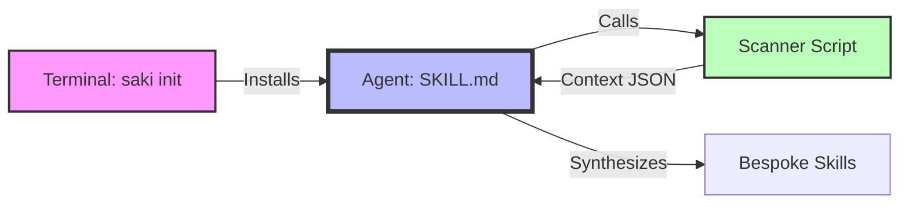

<div align="center">

# 🌸 Saki | 咲

**The Intelligent Skill Forge for AI Agents**

[English](README.md) | [简体中文](README_zh.md)

[](https://opensource.org/licenses/MIT)
[]()
[]()

> **"With Saki, Skills are Easy."**

</div>

---

## 😫 The Pain: "I just want it to work"

**The Scenario**:
1.  **You have tasks**: "I need to deploy this," "I need to refactor that."
2.  **You have a repo**: It has its own history, quirks, and tech stack.
3.  **You have preferences**: You hate manual boilerplate. You hate copying generic skills and rewriting them.

**The Problem**:
Writing a `SKILL.md` manually is tedious. Copying one from the internet requires too much modification to fit your project.

## 🌸 The Cure: Saki

**Delegate the bureaucracy to Saki.**

Saki is a **Meta-Agent** (Saki CLI + Saki Skill).
It sits inside your project, reads your **Tasks**, scans your **Repo**, respects your **Preferences**, and **forges** the perfect Skill for you.

It doesn't guess; it **Scans**, **Retrieves**, and **Synthesizes**.

**Saki turns "Generic AI" into "Senior Engineer AI".**

---

## 🚀 Quick Start (30 Seconds)

### Step 1: The Ritual (Install)
Inject the Saki Meta-Skill into your agent.

```bash
# Windows / Mac / Linux
python saki.py init
```
*(Saki automatically detects your OS language setting!)*

### Step 2: The Awakening (Forge)
Open your AI Assistant and type:

> **@Saki bootstrap**

### Step 3: The Magic
Saki will:
1.  🕵️ **Scan** your repo (detects Rust vs Node, Tailwind vs CSS, etc.).
2.  🧠 **Synthesize** a `SKILL.md` perfectly matched to your reality.
3.  ✨ **Result**: Your AI now knows *exactly* how to work in this codebase.

---

## 📂 Architecture



*Forged with 🌸 by Antigravity*
