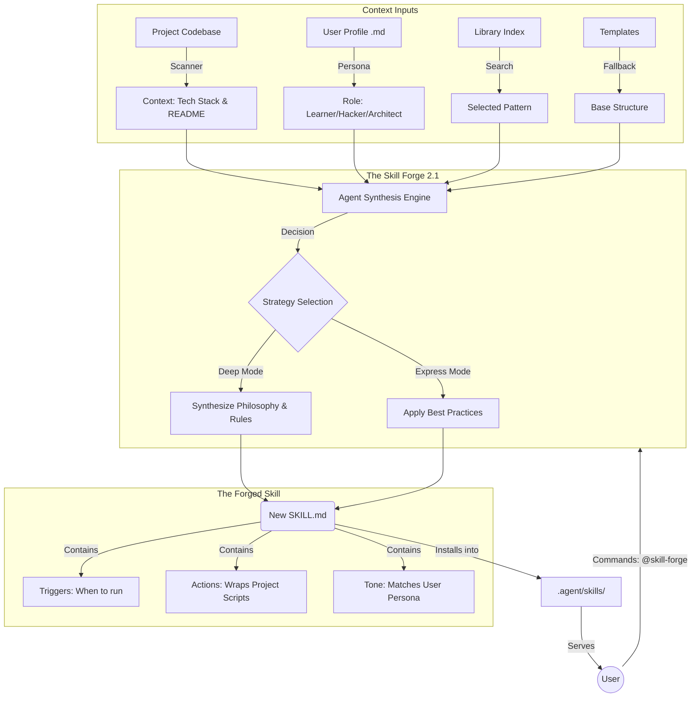

# System Architecture: The Intelligent Skill Forge

## 🧠 The "Meta-Forge" Workflow

This diagram explains how the **User Profile** and **Project Context** fuse together inside the **Meta-Skill** to generate a bespoke tool.



## 📂 The "Library" (Awesome Skills Corpus)

We don't just generate from thin air. We hold a reference library of 600+ skills categorized structure:

```text
/library
  ├── mcp/               # Model Context Protocol skills
  ├── frameworks/        # React, Next.js, Django
  ├── devops/            # Docker, Kubernetes, Terraform
  ├── languages/         # Python, Go, Rust, TypeScript
  └── tools/             # Git, Linear, Jira
```
