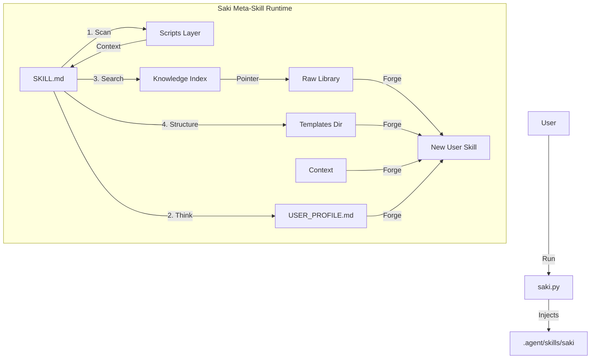

# Saki Component Documentation

> **Version**: 2.2.0 (Intelligent Bootstrap Edition)
> **Last Updated**: 2026-01-31

本文档详细拆解 Saki 项目的核心组件、职责边界及其实现原理。

## 🏛️ Architecture Overview (架构总览)

Saki 由三个核心层级组成：
1.  **Delivery Layer (交付层)**: 负责将 Saki 注入到用户的环境中。
2.  **Logic Layer (逻辑层)**: Agent 的思考核心与辅助脚本。
3.  **Data Layer (数据层)**: 庞大的知识库与索引。

---

## 🛠️ 1. Delivery Layer (交付层)

### `saki.py`
*   **职责**: "运输车"。负责将 Saki 的所有资产从本仓库复制到用户 IDE 的特定目录（如 `.agent/skills/` 或 `.cursor/rules/`）。
*   **实现**:
    *   Python 单文件脚本，零依赖（标准库）。
    *   **Interactive Mode**: 交互式菜单，询问用户由于 IDE 类型（Cursor/Claude/Antigravity）和安装位置（Global/Local）。
    *   **Localization**: 支持中/英双语 UI。

---

## 🧠 2. Logic Layer (逻辑层)

### `skills/saki/SKILL.md` (The Meta-Skill)
*   **职责**: "大脑"。定义了 Saki 作为 Agent 的行为准则、Prompt 逻辑和工具调用流程。
*   **实现**:
    *   **Cognitive Loop**: 定义了四个阶段的思考循环 (Awareness -> Retrieval -> Structure -> Synthesis)。
    *   **Protocols**:
        *   **Bootstrap Protocol**: 处理 `@Saki bootstrap` 指令，进行批量技能生成的逻辑定义。
        *   **Singleforge Protocol**: 处理单个技能生成的逻辑。
    *   **Tool Binding**: 显式绑定了 `scripts/` 下的 Python 脚本作为 Agent 的"手"。

### `skills/saki/scripts/` (Sensors & Effectors)
Agent 不直接操作底层文件，而是通过这些脚本来感知世界。

#### `context_scanner.py`
*   **职责**: "眼睛"。扫描当前项目环境。
*   **能力**:
    *   **Stack Detection**: 识别 `package.json`, `go.mod`, `Cargo.toml` 等。
    *   **NLP Analysis**: 读取 `README.md` 前 200 字符，提取非结构化关键词（如 "Pytorch", "Kubernetes"）。
    *   **Output**: 返回标准化的 JSON 格式环境报告。

#### `search_index.py`
*   **职责**: "海马体"。在毫秒级时间内检索知识库。
*   **实现**:
    *   读取 `library_index.json`。
    *   执行加权搜索：ID 匹配 (+10分) > Tag 匹配 (+5分) > 描述匹配 (+1分)。
    *   返回 Top 5 最相关的 Library 路径。

---

## 📚 3. Data Layer (数据层)

### `skills/saki/library/` (The Raw Corpus)
*   **职责**: "图书馆"。存储 3,500+ 个原始技能的最佳实践。
*   **内容**:
    *   结构化目录：`frameworks/`, `languages/`, `devops/`, `tools/`。
    *   每个目录包含经过验证的 `SKILL.md` 或 `README.md`。

### `skills/saki/knowledge/library_index.json`
*   **职责**: "目录卡片"。`library/` 的压缩索引。
*   **生成方式**: 由 `build_index.py` 离线生成。
*   **结构**: 包含 Skill ID, Description, Tags。Saki 运行时只读此文件，不遍历 Library。

### `skills/saki/templates/`
*   **职责**: "骨架"。提供生成 Skill 的标准结构。
*   **例子**:
    *   `coding.md`: 通用编码技能模板。
    *   `ops.md`: 运维/Docker 技能模板。
    *   `product.md`: 产品设计技能模板。

### `skills/saki/profiles/` & `USER_PROFILE.md`
*   **职责**: "人设"。
*   **USER_PROFILE.md**: 用户全局配置（语言偏好、角色偏好）。
*   **profiles/**: 预置的人设模板（Hacker, Learner, Enterprise）。

---

## 🔄 Workflow Summary (工作流总结)

当用户输入 `@Saki bootstrap` 时：
1.  **SKILL.md** 被唤醒 (LLM)。
2.  调用 `context_scanner.py` 获取环境信息 (`{"stack": ["rust", "tauri"]}`)。
3.  读取 `USER_PROFILE.md` 获取偏好 (`{"role": "hacker"}`)。
4.  LLM 规划出需要的技能列表：`["rust-async", "tauri-frontend", "security"]`。
5.  针对每个技能：
    *   调用 `search_index.py` 找到 Library 原始资料。
    *   读取 `templates/coding.md` 作为骨架。
    *   **LLM Synthesis**: 将 Library 知识 + Template 骨架 + 用户 Context 融合。
6.  生成最终文件到 `.agent/skills/`。
